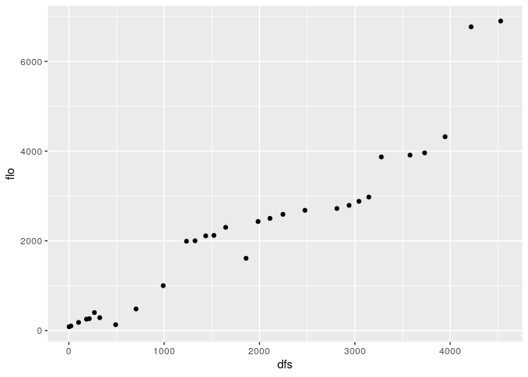
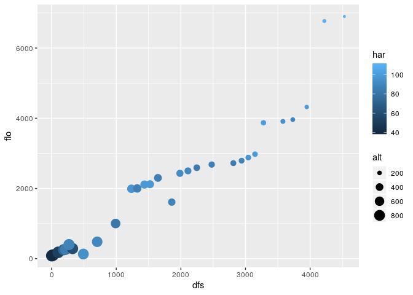
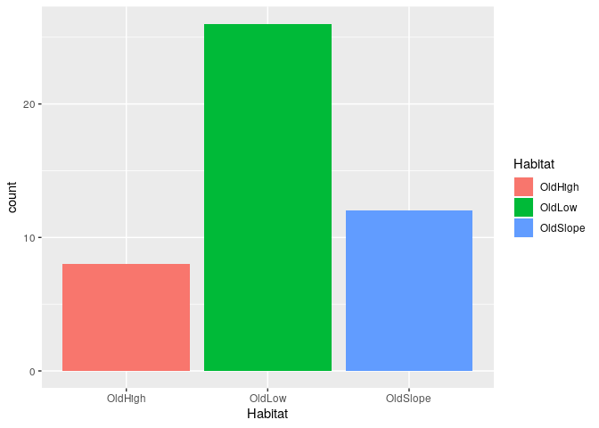
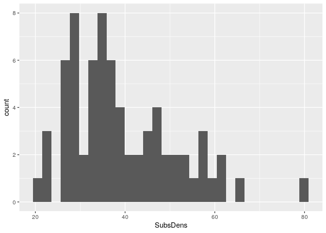
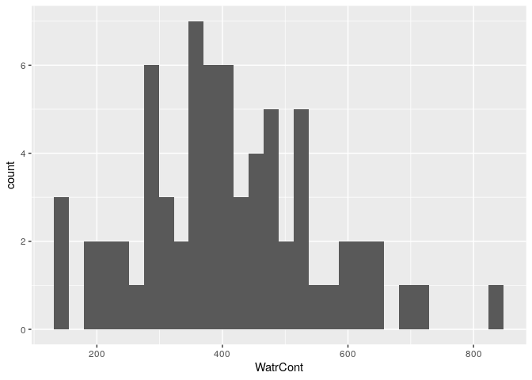
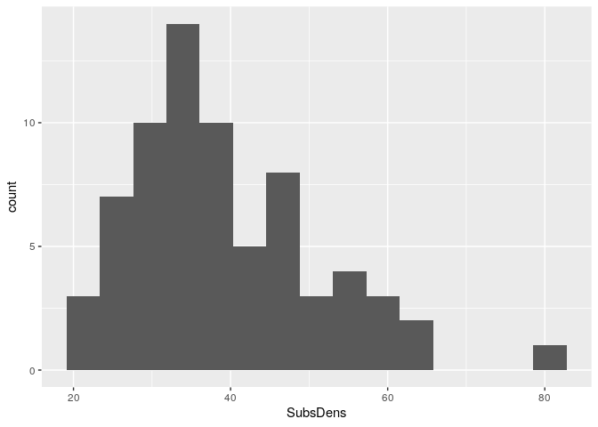
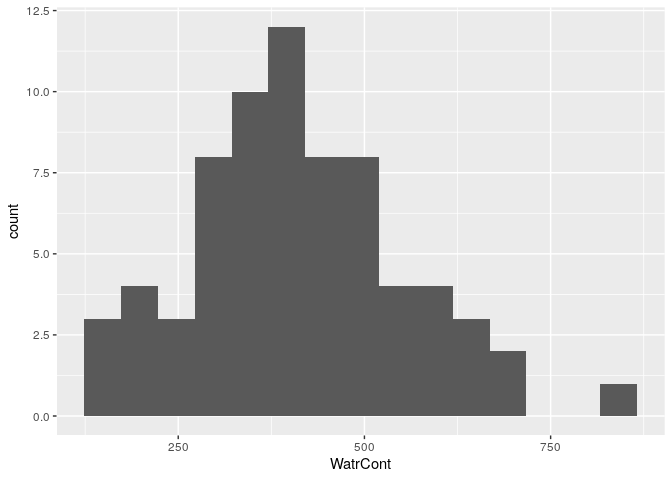
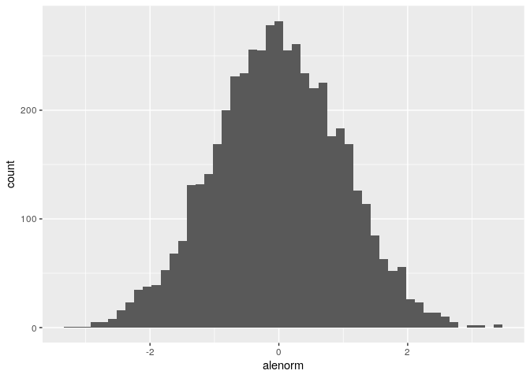
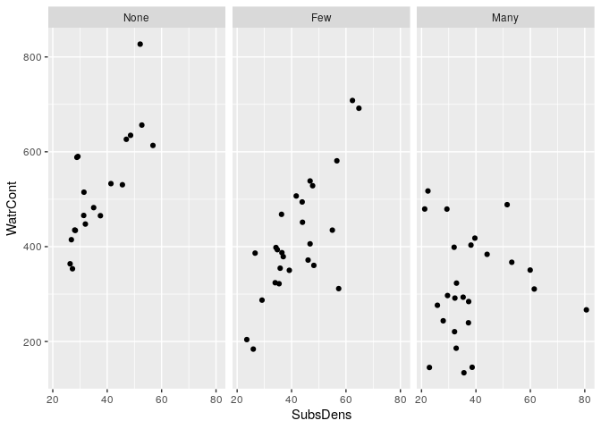
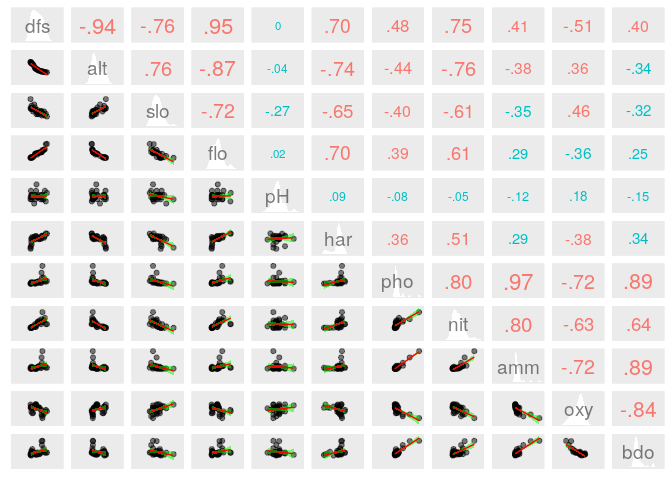

<!-- Este .md fue generado a partir del .Rmd homónimo. Edítese el .Rmd -->

# Introducción a R y análisis exploratorio de datos (EDA)

## Introducción a R

### Recursos

Te paso a continuación algunas fuentes (mayoritariamente en español)
sobre las aplicaciones que manejarás y otros recursos.

  - Sobre [R](https://www.r-project.org/)
      - [Vídeo corto sobre la historia de
        R](https://es.coursera.org/lecture/intro-data-science-programacion-estadistica-r/historia-e-introduccion-a-r-alNk0),
        donde podrás aprender algunas las características de R y el
        software libre en general, ventajas y desventajas de R, así como
        algunas aplicaciones.
      - [Libro R4DS, R for Data Science](https://r4ds.had.co.nz/), una
        fuente muy completa realizada principalmente por Wickham &
        Grolemund (2017), con apoyo de la comunidad R. [Fue traducido
        recientemente a español como “R para Ciencia de
        Datos”](https://es.r4ds.hadley.nz/) por la comunidad de R de
        Latinoamérica, y tiene por objetivo hacer R más accesible en la
        región. Es un buen punto de partida. La organización del libro,
        que priorice el aparato gráfico sobre la parte programática,
        ayudan a mantener la motivación en el aprendizaje de R. Seguiré
        este esquema, pero usando datos ecológicos, tanto para las
        asignaciones, como para este guión de referencia.
      - [Esta web](https://oscarperpinan.github.io/R/) es bastante
        completa, y es a la vez un buen lugar de referencia.
      - [Este
        libro](https://cran.r-project.org/doc/contrib/rdebuts_es.pdf)
        está organizado con enfoque de programación, todo un clásico.
      - La existencia de una diversa y activa comunidad R, motiva a
        muchos/as usuarios/as a usar este entorno de programación.
        [Abajo](#twitter) coloqué algunas cuentas de Twitter donde
        podrás observar en vivo una mínima parte de la actividad de la
        comunidad R. Hay muchas otras cuentas, foros, sitios web e
        incluso reuniones periódicas donde podrás interactuar con la
        comunidad. Te animo a descubrirlas.
      - [RStudio](https://www.rstudio.com/). Tanto la página de
        Wikipedia como [este
        vídeo](https://www.youtube.com/watch?v=5XeFFoTf2IY) explican
        muy bien en qué consiste este entorno de desarrollo integrado,
        además de que hace una breve introducción a qué es R.
  - [Git](https://git-scm.com/). Bueno, esta es una larga historia, que
    parece estar bien resumida en
    [Wikipedia](https://es.wikipedia.org/wiki/Git). Busca en YouTube, y
    verás otros aportes.
  - [GitHub](https://github.com/). Se erige como un servicio público
    para desarrolladores y desarrolladoras. Luce bien explicado
    [aquí](https://www.deustoformacion.com/blog/programacion-diseno-web/que-es-para-que-sirve-github).
  - [GitHub Classroom](https://github.com/education/classroom%5D). En
    [esta
    web](https://www.genbeta.com/desarrollo/classroom-for-github-ayudando-a-los-profesores-a-gestionar-los-ejercicios-de-sus-clases)
    te explican para qué sirve. Con este servicio estoy asignándote
    trabajo. También te recomiendo que leas [ésta
    afirmación](https://github.com/education/classroom#who-is-classroom-for).
  - Foros de ayuda y listas de distribución, entre los que destacan
    [R-help](https://stat.ethz.ch/mailman/listinfo/r-help),
    [R-devel](https://stat.ethz.ch/mailman/listinfo/r-devel),
    [Stackoverflow](https://stackoverflow.com/). Las preguntas deben
    plantearse con un ejemplo reproducible. Si vas a plantear una, lee
    antes las guías de publicación. Existe una [lista de distribución de
    R-help en español](https://stat.ethz.ch/mailman/listinfo/r-help-es),
    así como de [Stackoverflow en
    español](https://es.stackoverflow.com/).
  - <a name="twitter"></a>Twitter:
      - [The R Foundation](https://twitter.com/_r_foundation)
      - [RStudio](https://twitter.com/rstudio)
      - [RLadies](https://twitter.com/RLadiesGlobal)
      - [We Are R-Ladies](https://twitter.com/WeAreRLadies)
      - [Comunidad R Hispano](https://twitter.com/r_hisp?lang=es)
      - [Hadley Wickham](https://twitter.com/hadleywickham)
      - [Gabriela de Queiroz](https://twitter.com/gdequeiroz)
      - [R Consortium](https://twitter.com/rconsortium)
      - [UseR\! 2020](https://twitter.com/useR2020stl)
      - [UseR\! 2019](https://twitter.com/UseR2019_Conf)
      - [Rstats](https://twitter.com/rstatstweet)

### Instalación y ejecución de R y RStudio

  - Puedes usar el servidor RStudio habilitado por el profesor. Habrás
    recibido un correo electrónico con los detalles de acceso.

  - Si prefieres trabajar en tu propia PC, instala R y RStudio. La guía
    de instalación varía mucho según el sistema
        operativo:
    
      - [R](https://cloud.r-project.org/)
      - [RStudio](https://www.rstudio.com/products/rstudio/download/#download)

  - Igualmente, la forma de ejecutar estas aplicaciones dependerá del
    sistema operativo.
    
      - En GNU/Linux es posible ejecutar tanto aplicaciones tanto desde
        el gestor de ventanas como desde el intérprete de línea de
        órdenes (CLI) o “terminal” (por ejemplo, para ejecutar R,
        presiona `CRTL+ALT+T`, escribe `R` y presiona `<enter>`).
      - En Windows y MacOS la ejecución se realiza desde el GUI.

### CRAN (Comprehensive R Archive Network)

  - [¿Qué es
    CRAN?](https://cran.r-project.org/doc/FAQ/R-FAQ.html#What-is-CRAN_003f)
  - Instalar paquetes: Ejemplo: `install.packages('vegan', dependencies
    = T)`. Si realizas tus asignaciones en el servidor RStudio
    habilitado por el profesor, no necesitarás instalar paquetes.

### Ayuda de R

``` r
help(package = 'base') #Ayuda sobre un paquete
library(help = 'base') #Documentación sobre un paquete
help(lm) #Ayuda sobre una función
?lm #Ídem
example(lm) #Ejemplo(s) sobre una función
help.search("matrix") #Busca la palabra clave en las ayudas de los paquetes
??matrix #Ídem
```

¡Usa los foros\! Si introduces un mensaje de error de R en el buscador
de tu preferencia (en inglés obtienes más resultados), encontrarás
varios punteros a foros con posibles soluciones.

## Análisis exploratorio de datos (EDA)

Wickham & Grolemund (2017) afirman que, durante la producción de
resultados comunicables, subyace la necesidad de realizar el **análisis
exploratorio de datos (AED o EDA)** lo más rápidamente posible, pero
nunca obviarlo. Subyace la idea de que es necesario aligerar el EDA para
descubrir tantos patrones como sea posible sin que haya “pelearse” con
los datos para hacer simples gráficos. Esto permitirá al investigador/a
concentrarse en interpretar resultados. El esquema a continuación, de la
misma fuente, resume este
proceso:


**Las múltiples herramientas ofrecidas por los paquetes de la colección
`tidyverse` te servirán para agilizar sustancialmente el EDA**. Los
paquetes `dplyr`, `tidyr` y otros, te ayudarán a importar, ordenar y
transformar datos, mientras `ggplot2` te ayudará a crear gráficos
estilizados eficientemente. Wickham & Grolemund (2017) aseguran que
estas herramientas mantienen la motivación en el aprendizaje por sus
flujos de trabajo lineales.

### El conjunto de datos `doubs`

Una de las fuentes que utilizo en esta guía de referencia, es el
conjunto de datos `doubs` de Verneaux (1973). Se cargan meidante el
paquete `ade4`. Estos datos se utilizan también en Borcard, Gillet, &
Legendre (2018).

``` r
library(ade4)
data(doubs)
```

> **Nota**. Si no usas el servidor RStudio habilitado por el profesor,
> instala `ade4` (y cualquier otro paquete usado en este tutorial) con
> `install.packages('ade4', dependencies = T)`

La sentencia anterior carga el objeto `doubs` a memoria, pero no lo
imprime en pantalla. `doubs` es una lista de 4 tablas o `data.frame`,
etiquetadas como `env`-matriz ambiental, `fish`-matriz de comunidad
usando abundancia semi-cuantitativa (más explicación abajo), `xy`-matriz
de coordenadas de las muestras y `species`-nombres de las 27 especies
encontradas. Las filas de los tres primeros `data.frame` corresponden a
30 sitios muestreados a lo largo del río franco-suizo Doubs.

<a name="doubs"></a>Como ves, el objeto `doubs` se compone de varios
elementos, por lo que es preferible imprimirlo en pantalla por separado.
Para imprimir sólo un objeto de una lista, se usa el operador `$`. Así,
`doubs$env`, imprime sólo la matriz ambiental.

> Nota. Fíjate que tanto en estos datos de ejemplo, como en los
> siguientes, utilizaré una combinación de funciones y operadores para
> mostrar sólo una parte de las tablas. Esta operación la podemos
> denominar “filtrado”. Si la omitimos, la consola de R se desbordaría,
> y se generaría un documento innecesariamente largo. Más adelante
> descompongo en trocitos los pasos necesarios para filtrar, porque en
> tus asignaciones tendrás que hacerlo.

``` r
set.seed(98)
doubs$env[sample(1:30, 6), ] #Sólo 6 filas mostradas, elegidas al azar
##     dfs alt   slo  flo pH har pho nit amm oxy bdo
## 22 2940 254 2.708 2790 81  88  20 162   7  91  48
## 2    22 932 3.434  100 80  40   2  20  10 103  19
## 6   324 846 3.497  286 79  60  20  15   0 102  53
## 7   268 841 4.205  400 81  88   7  15   0 111  22
## 28 3947 195 1.386 4320 83 100  74 400  30  81  45
## 15 1645 415 1.792 2300 86  86  40 100   0 117  21
```

`doubs$env` contiene información ambiental de los 30 sitios de colecta
(filas) con las siguientes variables (columnas): `dfs`-distancia desde
cabecera (en km x 10), `alt`-altitud (en m), `slo`-pendiente (log(x+1),
donde x es la pendiente en tantos por 1000), `flo`-caudal promedio
mínimo (m<sup>3</sup>/s 100), `pH` ( x 10), `har`-dureza del agua (mg/l
de calcio), `pho`-fosfatos (mg/l x 100), `nit`-nitratos, `amm`-amoníaco
(mg/l x 100), `oxy`-oxígeno disuelto (mg/l x 100), `bdo`-demanda
biológica de oxígeno (mg/l x 10)

La tabla `doubs$fish`, asociada a la anterior, contiene la abundancia de
especies por sitio. Los valores de las celdas no son individuos; la
abundancia está representada en una escala semi-cuantitativa específica
por especie, que va de 0 a 5, es decir, se trata de una escala de
pseudo-abundancia más propiamente. Por lo tanto, los valores no pueden
entenderse como estimadores insesgados de la abundancia real o de la
biomasa por sitio (Borcard et al., 2018).

``` r
set.seed(99)
doubs$fish[sample(1:30, 6), sample(1:27, 6)] #Sólo 6 filas y columnas mostradas, elegidas al azar
##    Rham Cogo Spbi Icme Ruru Abbr
## 3     0    0    0    0    0    0
## 10    0    0    0    0    0    0
## 2     0    0    0    0    0    0
## 6     0    0    0    0    1    0
## 13    0    2    0    0    0    0
## 20    3    0    3    0    5    1
```

Determinados gráficos de ordenación se vuelven ilegibles cuando se usan
los nombres completos de las especies. Por tal razón, es práctica común
abreviarlos, tal como verás en los nombres de columnas, donde se usan
abreviaturas de cuatro caracteres. La correspondencia entre estas
abreviaturas y los nombres completos de las especies, se encuentra
explicada en la tabla `doubs$species`.

``` r
doubs$species
##                     Scientific             French           English code
## 1                 Cottus gobio             chabot european bullhead Cogo
## 2           Salmo trutta fario       truite fario       brown trout Satr
## 3            Phoxinus phoxinus             vairon            minnow Phph
## 4       Nemacheilus barbatulus      loche franche       stone loach Neba
## 5          Thymallus thymallus              ombre          grayling Thth
## 6     Telestes soufia agassizi            blageon           blageon Teso
## 7           Chondrostoma nasus               hotu              nase Chna
## 8       Chondostroma toxostoma          toxostome         toxostoma Chto
## 9          Leuciscus leuciscus           vandoise       common dace Lele
## 10 Leuciscus cephalus cephalus           chevaine              chub Lece
## 11               Barbus barbus barbeau fluviatile            barbel Baba
## 12       Spirlinus bipunctatus            spirlin           spirlin Spbi
## 13                 Gobio gobio             goujon           gudgeon Gogo
## 14                 Esox lucius            brochet              pike Eslu
## 15           Perca fluviatilis  perche fluviatile             perch Pefl
## 16              Rhodeus amarus           bouviere        bitterling Rham
## 17            Lepomis gibbosus      perche-soleil       pumpkinseed Legi
## 18  Scardinius erythrophtalmus           rotengle              rudd Scer
## 19             Cyprinus carpio              carpe              carp Cyca
## 20                 Tinca tinca             tanche             tench Titi
## 21               Abramis brama              breme  freshwater bream Abbr
## 22             Ictalurus melas       poisson chat    black bullhead Icme
## 23              Acerina cernua           gremille             ruffe Acce
## 24             Rutilus rutilus             gardon             roach Ruru
## 25             Blicca bjoerkna   breme bordeliere      silver bream Blbj
## 26           Alburnus alburnus            ablette             bleak Alal
## 27           Anguilla anguilla           anguille               eel Anan
```

Las cuatro columnas corresponden a: `Scientific`-nombre científico,
`French` y `English`-nombres comunes en francés y en inglés, `code`
códigos de cuatro caracteres usados como nombres de columnas en la
tabla `doubs$fish`.

### El conjunto de datos `BCI`

`BCI` es una matriz de comunidad, muy popular en ecología, porque se
utiliza como conjunto de datos modelo en el paquete `vegan`, muy usado
en ecología (Oksanen et al., 2013). `BCI` contiene conteos (abundancias
reales) de árboles de al menos 10 cm de diámetro a la altura de pecho
(DAP o *DBH*) registrados en 50 parcelas (filas de la matriz) de 1
hectárea cada una, para un total de 225 especies (columnas de la
matriz). Los nombres científicos se muestran íntegramente, aunque el
espacio separador entre género y especie es sustituido por un `.`. A
continuación se muestra una selección aleatoria de 6 parcelas y 3
especies de la matriz de comunidad.

``` r
library(vegan)
data(BCI)
set.seed(10)
BCI[sample(1:50, 6), sample(1:225, 3)] #Sólo 6 filas y 3 columnas mostradas, elegidas al azar
##    Nectandra.lineata Ficus.insipida Inga.umbellifera
## 12                 1              0                0
## 8                  0              0                2
## 39                 2              0                0
## 19                 0              0                1
## 24                 1              0                0
## 15                 0              0                1
```

En el mismo paquete se encuentra también la matriz ambiental `BCI.env`,
asociada a la anterior. `BCI.env` es un `data.frame` de 50 parcelas
(filas) y nueve variables de sitio (columnas) descritas a continuación.
`UTM.EW` y `UTM.NS`-coordenadas UTM de falso Este y falso Norte (zona
17N), `Precipitation`-precipitación en mm por año, `Elevation`-elevación
en metros sobre el nivel del mar, `Age.cat`-categoría de edad del
bosque, `Geology`-formación geológica subyacente, `Habitat`-tipo hábitat
dominante predominante, `Stream`-“*Yes*” si hay un hábitat de ribera
fluvial en la parcela, `EnvHet`-heterogeneidad ambiental evaluada por
medio de la diversidad de frecuencia de tipos de hábitat de Simpson en
25 celdas de cuadrícula dentro de la parcela. Puedes consultar
información detallada sobre cada variable en Harms, Condit, Hubbell, &
Foster (2001).

``` r
data(BCI.env)
set.seed(11)
BCI.env[sample(1:50, 6), ] #Sólo 6 filas mostradas, elegidas al azar
##    UTM.EW  UTM.NS Precipitation Elevation Age.cat Geology  Habitat Stream
## 34 626354 1011869          2530       120      c3      Tb  OldHigh     No
## 25 626154 1011969          2530       120      c3      Tb   OldLow     No
## 16 626054 1011569          2530       120      c3      Tb OldSlope     No
## 37 626454 1011669          2530       120      c3      Tb  OldHigh     No
## 12 625954 1011669          2530       120      c3      Tb   OldLow     No
## 21 626154 1011569          2530       120      c3      Tb OldSlope     No
##    EnvHet
## 34 0.0000
## 25 0.6080
## 16 0.4608
## 37 0.3648
## 12 0.0000
## 21 0.2688
```

### El conjunto de datos `mite`

`mite` es un conjunto de tres `data.frame` sobre ácaros oribatidos y sus
variables ambientales, colectados en 70 sitios mediante núcleos de suelo
en una parcela de 2.5 x 10 m, los cuales fueron publicados en dos
trabajos (Borcard & Legendre, 1994; Borcard, Legendre, & Drapeau, 1992).
Al igual que los anteriores, este conjunto de datos se carga a través
del paquete `vegan`. El primero, `mite` propiamente, contiene la matriz
de comunidad con los datos de abundancia de 35 especies (columnas) de
ácaros oribátidos para cada uno de los 70 sitios (filas).

``` r
data(mite)
set.seed(40)
mite[sample(1:70, 6), sample(1:35, 6)] #Sólo 6 filas y 6 columnas mostradas, elegidas al azar
##    Ceratoz1 FSET PHTH PPEL TVEL Miniglmn
## 35        2    1    0    0    2        0
## 34        0    2    0    0   22        0
## 12        5    5    2    1   27        0
## 61        2    0    0    0    0        0
## 50        3    0    0    0    0        0
## 52        1    0    0    0    0        0
```

`mite.env` contiene datos ambientales de los sitios de colecta, que
incluye `SubsDens`-densidad del sustrato (g/L); `WatrCont`-contenido de
agua del substrato (g/L); `Substrate`-tipo de substrato, pudiendo tomar
los valores `Sphagn1`, `Sphagn2`, `Sphagn3`, `Sphagn`, `Litter`,
`Barepeat` e `Interface`; `Shrub`-que indica la densidad de arbustos,
pudieno tomar tres posibles niveles `None` (ninguno), `Few` (pocos) o
`Many` (muchos); finalmente la variable `Topo`-que puede tomar los
valores `Blanket` y `Hummock`.

``` r
data(mite.env)
set.seed(30)
mite.env[sample(1:70,6),] #Sólo 6 filas mostradas, elegidas al azar
##    SubsDens WatrCont Substrate Shrub    Topo
## 50    28.29   434.28 Interface  None Blanket
## 46    44.01   451.45   Sphagn1   Few Blanket
## 13    27.97   243.70   Sphagn1  Many Hummock
## 10    32.14   220.73   Sphagn1  Many Hummock
## 59    52.73   656.35   Sphagn1  None Blanket
## 29    32.86   323.12 Interface  Many Hummock
```

Finalmente, `mite.xy` contiene las coordenadas (con origen arbitrario)
de los 70 sitios.

``` r
data(mite.xy)
set.seed(50)
mite.xy[sample(1:70,6),] #Sólo 6 filas mostradas, elegidas al azar
##       x   y
## 11 2.40 1.9
## 52 0.05 7.3
## 46 1.60 6.1
## 67 2.40 9.1
## 8  2.00 1.3
## 16 0.05 2.7
```

### Un **“detallito”** sobre matrices de comunidad y ambientales en R

**La mayoría de los paquetes para análisis en ecología asumen que el
orden de las filas de las matrices de comunidad y ambiental es
consistente**. Por ejemplo, `vegan` asume que la fila `n` de las
matrices de comunidad y ambiental se refiere al mismo “sitio”. Es decir,
la fila `n` informa por un lado del mismo sitio sobre las especies, y
por otro sobre las variables ambientales. Si por accidente, o
deliberadamente, las filas se reordenaran en una matriz, sin hacerlo
igualmente en la otra, cualquier análisis que intente poner en relación
datos composicionales con ambientales será fútil e inconsistente.

Se trata de un **pequeño detalle a tener muy presente** al momento de
manipular datos ecológicos. Una medida para evitar posibles errores,
sería crear columnas de nombres de sitios a partir de los nombres de
filas en ambas matrices, justo después de cargarlas. Si se perdiera la
integridad entre ambas siempre se podrían hacer uniones a partir de
dichas columnas.

### Una pequeña parada para explicar cómo filtrar

Habrás notado en las sentencias anteriores que utilicé una combinación
de funciones (`set.seed` y `sample`) y el operador `[`. Aunque con la
colección `tidyverse` verás una sintaxis más “fluida” para filtrar
`data.frame`, en este apartado lo haré usando los operadores `[` y `<-`,
así como las funciones `subset`, `set.seed`, `sample` y `nrow`, todas
del paquete `base`.

Supón que el tali te pide que separes, de la matriz de comunidad `BCI`,
un subconjunto aleatorio de 15 muestras (cada muestra es una fila).
Primero crearé un objeto que contenga el número de filas de `BCI` y,
posteriormente, de ese número total pediré que tome una muestra de 15
números.

El primer paso, crear el objeto con el número de filas de `BCI`, lo
realizo con la función `nrow` (*number of rows*), asignando su resultado
a un nuevo objeto, que denomino `nfbci`. Fíjate que, para crear dicho
objeto es necesario incluir el operador de asignación (`<-`); míralo
como una flecha, hacia donde apunta es el nombre del objeto nuevo que
deseo crear (`nfbci`), mientras que el lado contrario contiene el valor
que asumirá dicho objeto, `nrow(BCI)`. Cuando el objeto `nfbci` es
impreso en pantalla devuelve el valor 50, que es el número de filas de
`BCI`.

Bien, ahora que tenemos el número de filas de `BCI`, hay que seleccionar
15 números aleatorios entre el 1 y el 50. El objeto `quincefilas` toma
el valor del resultado de la función `sample(1:nfbci, 15)`. Los
argumentos de esta función se explican así: el primer argumento es
`1:nfbci`, que devuelve un vector de 50 números, del 1 al 50, en orden
secuencial. El segundo argumento de la función es el número de valores a
seleccionar del vector, que en este caso es 15. Así, `quincefilas` es un
vector de 15 elementos, cuyos valores se encuentran entre 1 y 50.

> Nota. La función `set.seed` sirve para garantizar que este ejemplo sea
> reproducible, porque fija una “semilla” (forma de colectar datos en el
> generador de números aleatorios). El número dentro de dicha función es
> arbitrario. Así, con independencia de las veces que ejeuctes este
> ejemplo, `set.seed` garantizará que siempre se elijan los mismo 15
> números. Prueba excluyendo la función, y notarás que en cada corrida
> obtienes conjuntos diferentes de 15 números diferentes.

Finalmente, introducimos el vector `quincefilas` dentro de los corchetes
luego de `BCI` y lo asignamos a `miBCI`. Veamos dicha línea descompuesta
en partes. Denominemos `x` a un `data.frame`. Podemos filtrar a `x`
mediante índices de extracción de filas `i` y columnas `j`, de la
siguiente manera: `x[i,j]`. Como ves, el índice de filas corresponde a
la primera parte dentro de los corchetes, y el índice de columnas a la
segunda. Así, si necesito la fila 1 de `x`, con todas sus columnas, sólo
escribo `x[1,]`; si sólo necesito la fila 1 columna 1 ejecuto `x[1,1]`.
En el caso que nos ocupa abajo, `BCI` es el `data.frame`, y el índice de
filas es el objeto `quincefilas`. Dado que no especifico columnas, las
devuelve todas. Así, el nuevo `miBCI` es un subconjunto de `BCI`, con
quince filas elegidas aleatoriamente. Nota que al asignar no se
especifican columnas, pero al imprimir sí especifico columnas
(`miBCI[,1:3]`), concretamente las tres primeras, para así evitar
desbordar el documento. A continuación te explico cómo explorar la
estructura básica de la matriz de comunidad.

``` r
nfbci <- nrow(BCI)
nfbci
## [1] 50
set.seed(300)
quincefilas <- sample(1:nfbci, 15)
quincefilas
##  [1] 14 42  2 25 28 21 41 19 44 16 13 12 39 43 38
miBCI <- BCI[quincefilas,]
miBCI[,1:3]
##    Abarema.macradenia Vachellia.melanoceras Acalypha.diversifolia
## 14                  0                     0                     0
## 42                  0                     0                     0
## 2                   0                     0                     0
## 25                  0                     0                     0
## 28                  0                     2                     0
## 21                  0                     0                     0
## 41                  0                     0                     0
## 19                  0                     0                     0
## 44                  0                     0                     0
## 16                  0                     0                     0
## 13                  0                     0                     0
## 12                  0                     0                     0
## 39                  0                     0                     0
## 43                  0                     0                     0
## 38                  0                     0                     0
```

### Básicos de una matriz de comunidad

Una de las primeras tareas en el EDA consiste en saber cuántos sitios y
cuántas especies tiene nuestra muestra. Veamos todas las matrices
comunidad, compáremoslas. El número de sitios es equivalente al número
de filas, por lo que se puede determinar con la siguiente sentencia:

> Nota. Recuerda que la matriz de comunidad del conjunto de datos
> `doubs` es un `data.frame` dentro de una lista, y se obtiene por medio
> de `doubs$fish`.

``` r
nrow(doubs$fish)
## [1] 30
```

El número de especies por sitio se cuenta con la función `specnumber`
del paquete `vegan`. La función sólo cuenta aquellas columnas que no
tengan ceros.

``` r
specnumber(doubs$fish)
##  1  2  3  4  5  6  7  8  9 10 11 12 13 14 15 16 17 18 19 20 21 22 23 24 25 
##  1  3  4  8 11 10  5  0  5  6  6  6  6 10 11 17 22 23 23 22 23 22  3  8  8 
## 26 27 28 29 30 
## 21 22 22 26 21
```

Nota que la parte superior del resultado es el nombre del sitio, y la
inferior es el número de especies. Por ejemplo, el sitio 1 tiene 1
especie, el 2 tiene 3, el 3 tiene 4, el 4 tiene 8, …, el 30 tiene 21.

Notarás que los sitios están ordenados según el orden secuencial de
filas, y por ello no vemos claramente cuál sitio tiene mayor riqueza y
cuál tiene la menor. Mejor ordenamos el resultado…

``` r
sort(specnumber(doubs$fish))
##  8  1  2 23  3  7  9 10 11 12 13  4 24 25  6 14  5 15 16 26 30 17 20 22 27 
##  0  1  3  3  4  5  5  6  6  6  6  8  8  8 10 10 11 11 17 21 21 22 22 22 22 
## 28 18 19 21 29 
## 22 23 23 23 26
```

…y nos damos cuenta rápidamente que el sitio 29 es el de mayor riqueza
numérica, y que en el sitio 8 no se registró ninguna especie. Si
aplicamos estas mismas sentencias a los demás conjntos de datos veremos
resultados interesantes.

``` r
#BCI
nrow(BCI)
## [1] 50
sort(specnumber(BCI))
##  31  40  44  45   7  38  35   2  12  39   6  28  29  33  43  46  11  42 
##  77  80  81  81  82  82  83  84  84  84  85  85  86  86  86  86  87  87 
##   8  32  37  18   3   9  22  26  48  49  34  36   1  13  15  16  17  50 
##  88  88  88  89  90  90  91  91  91  91  92  92  93  93  93  93  93  93 
##   4  10  24  30  14  21  23  27  20   5  41  47  25  19 
##  94  94  95  97  98  99  99  99 100 101 102 102 105 109

#mite
nrow(mite)
## [1] 70
sort(specnumber(mite))
## 44 57 62 67 59 54 29 55 61 42 39 41 50 56 58 40 43 48 52 60 24 49 64 65 68 
##  5  5  6  6  7  8  9  9  9 10 11 11 11 11 11 12 12 12 12 12 13 13 13 13 13 
## 17 22 38 47 51 66 23 31 53 70  7  9 21 32 33 37 46 63 16 26 45 69 13 15 18 
## 14 14 14 14 14 14 15 15 15 15 16 16 16 16 16 16 16 16 17 17 17 17 18 18 18 
## 28 35 36  3  5 10 12 25  1 20  6  8 19 30 34 27  2  4 14 11 
## 18 18 18 19 19 19 19 19 20 20 21 21 21 21 21 22 23 23 23 25
```

Un resultado que también debe salir del EDA es la riqueza de la toda la
muestra. Para ello necesitamos que `vegan` vea nuestra matriz de forma
combinada (*pooled*), lo cual haremos con la función `colSums`. Así,
generamos un vector que contiene las sumas de individuos por especie (en
el caso del conjunto `doubs` no, por tratarse de una matriz de escala
semi-cuantitativa). A dicha matriz le podemos calcular su riqueza
numérica con `specnumber`.

``` r
# doubs
doubs_comb <- colSums(doubs$fish)
doubs_comb
## Cogo Satr Phph Neba Thth Teso Chna Chto Lele Lece Baba Spbi Gogo Eslu Pefl 
##   15   57   68   73   15   19   18   26   43   56   43   27   55   40   36 
## Rham Legi Scer Cyca Titi Abbr Icme Acce Ruru Blbj Alal Anan 
##   33   29   21   25   45   26   18   38   63   31   57   27
specnumber(doubs_comb)
## [1] 27

# BCI
BCI_comb <- colSums(BCI)
BCI_comb[1:20] #Dado que son tantas especies, imprimo sólo las primeras 20
##       Abarema.macradenia    Vachellia.melanoceras    Acalypha.diversifolia 
##                        1                        3                        2 
##    Acalypha.macrostachya           Adelia.triloba     Aegiphila.panamensis 
##                        1                       92                       23 
##  Alchornea.costaricensis      Alchornea.latifolia         Alibertia.edulis 
##                      156                        1                        1 
##  Allophylus.psilospermus         Alseis.blackiana        Amaioua.corymbosa 
##                       27                      983                        3 
##      Anacardium.excelsum           Andira.inermis          Annona.spraguei 
##                       22                       28                       27 
##            Apeiba.glabra         Apeiba.tibourbou  Aspidosperma.desmanthum 
##                      236                       21                       52 
## Astrocaryum.standleyanum     Astronium.graveolens 
##                      201                       39
specnumber(BCI_comb)
## [1] 225

# mite
mite_comb <- colSums(mite)
mite_comb
##   Brachy     PHTH     HPAV     RARD     SSTR  Protopl     MEGR     MPRO 
##      611       89      596       85       22       26      153       11 
##     TVIE     HMIN    HMIN2     NPRA     TVEL     ONOV     SUCT     LCIL 
##       58      344      137      132      634     1209     1187     2468 
## Oribatl1 Ceratoz1     PWIL Galumna1 Stgncrs2     HRUF Trhypch1     PPEL 
##      132       90       76       67       51       16      183       12 
##     NCOR     SLAT     FSET Lepidzts Eupelops Miniglmn     LRUG    PLAG2 
##       79       28      130       12       45       17      730       56 
## Ceratoz3 Oppiminu Trimalc2 
##       91       78      145
specnumber(mite_comb)
## [1] 35
```

### Diagrama de dispersión

Lee sobre el [diagrama de
dispersión](https://es.wikipedia.org/wiki/Diagrama_de_dispersi%C3%B3n).
Si observas detenidamente las variables `dfs` y `flo` de la [tabla
`doubs$env`](#doubs), quizá no detectes a golpe de vista que existe
correlación entre ambas; es precisamente en este punto donde los
gráficos te pueden ayudar.

``` r
library(tidyverse)
```

> **Nota**. Si no realizas tu asignación en el servidor RStudio
> habilitado por el profesor, debes asegurarte de instalar la colección
> `tidyverse` (`install.packages(tidyverse, dependencies=T)`).

El gráfico de dispersión a continuación muestra que existe correlación
positiva entre las variables seleccionadas.

``` r
ggplot(data = doubs$env) +
  geom_point(mapping = aes(x = dfs, y = flo))
```

<!-- -->

Lógicamente, como es de esperar, a mayor distancia de la cabecera, mayor
el caudal. Destacan también dos observaciones atípicas en el extremo
superior derecho del gráfico, que corresponden a dos puntos de colecta
que obtuvieron valores de flujo muy altos. Volveré sobre estos valores
extremos (*outliers*) maś adelante.

`ggplot` crea el sistema de coordenadas a partir del objeto introducido
en el argumento `data`, es decir, a partir del conjunto de datos. Por lo
tanto, si ejecutaras `ggplot(data = doubs$env)` obtendrías un gráfico
vacío. Tomar en cuenta que `ggplot` requiere un objeto de clase
`data.frame` para el argumento `data`. Si el objeto introducido no lo
es, pero es “convertible” (*coercible*) a un `data.frame`, la función lo
convertirá, de lo contrario, aparecerá un mensaje de error.

A partir de este punto, se pueden añadir una o más capas. En este caso,
se añadió una de puntos mediante `geom_point`. Las capas usan el
argumento `mapping` para definir la posición y el rol de cada variable
en el gráfico. Por lo tanto, los elementos básicos son crear el sistema
de coordenadas (`ggplot`), especificar los datos, crear una capa (e.g.
`geom_point`) y decclarar cómo se posicionarán las variables.
[Aquí](https://www.rstudio.com/wp-content/uploads/2015/03/ggplot2-cheatsheet.pdf)
tienes una guía de referencia sobre las capas más comunes.

Puedes editar la forma y el tamaño de todos los elementos del gráfico:
rótulos, simbología, cuadrícula, ejes, etc. Existen múltiples
argumentos disponibles para gráficos estéticos, que encontrarás en guías
de `ggplot2` en línea, como
[ésta](https://www.rdocumentation.org/packages/ggplot2/versions/3.2.1)
y
[esta](https://swcarpentry.github.io/r-novice-gapminder-es/08-plot-ggplot2/index.html).
También puedes ver [esta galería](http://www.ggplot2-exts.org/gallery/)
para conocer distintas formas de visualizar datos. Puedes también
consultar Wickham (2016), un material de contenido exhaustivo y de
referencia, donde verás las distintas capas y configuraciones estéticas.

Mostraré los puntos en función de su condición de *outliers*, utilizando
distintos colores y formas. No prestes mucha atención a la primera línea
de código, sino al gráfico resultante

``` r
flo_outlier <- ifelse(
  doubs$env$flo %in% invisible(boxplot(doubs$env$flo)$out),
  'outlier', 'no outlier')
```

``` r
ggplot(data = doubs$env) +
  geom_point(mapping = aes(x = dfs, y = flo, colour = flo_outlier))
```

<!-- -->

``` r
ggplot(data = doubs$env) +
  geom_point(mapping = aes(x = dfs, y = flo, size = flo_outlier))
## Warning: Using size for a discrete variable is not advised.
```

<!-- -->

``` r
ggplot(data = doubs$env) +
  geom_point(mapping = aes(x = dfs, y = flo, shape = flo_outlier))
```

<!-- -->

El estético `size` admite variables cuantitativas. El gráfico a
continuación nos informa con bastante propiedad sobre una combinación de
variables, usando la elevación como estético de tamaño y dureza del
dureza del agua como color. Nótese, por ejemplo, que la elevación y
están inversamente relacionados, a menor elevación (círculos más
pequeños) mayor dureza (rellenos más azules).

``` r
ggplot(data = doubs$env) +
  geom_point(mapping = aes(x = dfs, y = flo, size = alt, colour = har))
```

<!-- -->

Aunque no son muy informativos sin barras de error, los diagramas de
barras pueden ser útiles en determinados contextos. Utilizaré la escala
semi-cuantitativa de abundancia (pseudo-abundancia) para responder a la
pregunta: ¿Cuál es el nivel de pseudo-abundancia predominante de `Salmo
trutta fario` en la muestra?

``` r
ggplot(data = doubs$fish) + geom_bar(mapping = aes(x=Satr))
```

<!-- -->

Este gráfico “informa” que el nivel de de pseudo-abundancia más común es
0, es decir, la subespecie está ausente en 13 de los 30 sitios, con lo
que es más común no encontrarla. Si ordenásemos las pseudo-abundancias
de `Satr` de menor a mayor, podríamos igualmente notar este patrón, lo
cual sugiere que el gráfico no aporta mucho más que lo que lo haría un
vector ordenado.

``` r
sort(doubs$fish[,2])
##  [1] 0 0 0 0 0 0 0 0 0 0 0 0 0 1 1 1 2 2 3 3 3 3 4 4 5 5 5 5 5 5
```

Fíjate en este otro gráfico de barras usando el conjunto de datos `BCI`.
El argumento `fill` en el segundo gráfico rellena las barras de manera
que se pueden diferencias los distintos hábitat con mayor facilidad. Es
posible configurar los colores en cada caso con la funcipon
`scale_fill_discrete`

``` r
ggplot(data = BCI.env) +  geom_bar(mapping = aes(x = Habitat))
```

<!-- -->

``` r

ggplot(data = BCI.env) +
  geom_bar(mapping = aes(x = Habitat, fill = Habitat))
```

<!-- -->

Nota que hay dos hábitats escasamente representados, que son *Swamp* y
*Young*. El EDA está informando que, en determinados análisis, estos
grupos no aportarían efectos sistemáticos o, en su defecto, harían que
determinados supuestos no se cumplieran. No entraré en detalles del
filtro que apliqué a los datos para excluir ambos grupos (más adelante
verás cómo usar `tidyverse` para filtrar datos y otras tareas), así que
ignora la parte “fea” del código y fíjate en el gráfico.

``` r
grupos_numerosos <- droplevels(
  BCI.env[!BCI.env$Habitat %in% c('Swamp', 'Young'), ]
)
ggplot(data = grupos_numerosos) +
  geom_bar(mapping = aes(x = Habitat, fill = Habitat))
```

<!-- -->

Para variables cuantitativas, el diagrama de cajas, mejor conocido como
*boxplot*, es sin duda un apoyo fundamental. Te recomiendo la [entrada
de Wikipedia](https://es.wikipedia.org/wiki/Diagrama_de_caja) sobre este
útil gráfico. A golpe de vista, verás a continuación la variable
“heterogeneidad ambiental” según hábitats, utilizando el objeto
`grupos_numerosos` creado en el trozo de código anterior (excluye los
hábitats poco representados).

``` r
ggplot(data = grupos_numerosos) +
  geom_boxplot(mapping = aes(x = Habitat, y = EnvHet, fill = Habitat))
```

<!-- -->

¿Qué patrón percibes? Compara la heterogeneidad ambiental en los bosques
viejos sobre vertiente (`OldSlope`) con la de los demás hábitats. ¿Qué
diferencias notas?

El histograma es otra herramienta gráfica utilizada en el EDA. Nos
informa sobre las características de la distribución (sesgo, varianza,
etc.) de la muestra respecto de una variable cuantativa. Te recomiendo
que estudies sobre los conceptos y la interpretación del histograma,
comenzando si lo deseas por
[Wikipedia](https://es.wikipedia.org/wiki/Histograma), pero no olvides
utilizar referencias sobre su uso en ecología (Borcard et al., 2018). El
siguiente histograma muestra la distribución de dos variables
ambientales del conjunto de datos `mite`. El primero muestra la densidad
de substrato, el segundo el contenido de agua.

``` r
ggplot(data = mite.env) +
  geom_histogram(mapping = aes(x = SubsDens))
## `stat_bin()` using `bins = 30`. Pick better value with `binwidth`.
```

<!-- -->

``` r

ggplot(data = mite.env) +
  geom_histogram(mapping = aes(x = WatrCont))
## `stat_bin()` using `bins = 30`. Pick better value with `binwidth`.
```

<!-- -->

El gráfico es informativo, y de hecho se observan patrones, pero las
barras están separadas; mientras más pequeña es la muestra, peor se verá
el resultado. Antes de interpretarlo es preferible corregirlo. Para
ello, se podría usar el consejo que aparece en la advertencia devuelta
por la consola (elegir una anchura de intervalo mejor), aunque por
simplicidad es reduciré el número de intervalos. Los gráficos siguientes
muestran un mejor resultado:

``` r
ggplot(data = mite.env) +
  geom_histogram(mapping = aes(x = SubsDens), bins = 15)
```

<!-- -->

``` r

ggplot(data = mite.env) +
  geom_histogram(mapping = aes(x = WatrCont), bins = 15)
```

<!-- -->

El resultado es más legible ahora. En ambos casos podemos ver que existe
un sesgo a la derecha (o positivo), más acentuado en la variable
`SubsDens` que en `WatrCont`. Esto significa que la media probablemente
está a la derecha del intervalo modal, es decir, los valores extremos
“tiran” de ella hacia la derecha, un hecho evidente especialmente en
el histograma de la densidad de substrato. Notarás igualmente que el
histograma de la variable `WatrCont` se aproxima más a una forma
acampanada, mientras que el histograma de `SubsDens` está un poco más
alejado de dicha forma. En ecología, la mayoría de los datos no muestran
distribución normal, por lo que las técnicas de estadística paramétrica
en muchos casos son inútiles (Borcard et al., 2018). El histograma es el
primer paso para descubrir este fenómeno, y es sin duda de gran ayuda
para elegir apropiadamente las técnicas a utilizar. A modo de
referencia, incluyo a continuación un histograma con forma acampanada de
una muestra ficticia de 5000 elementos construida a partir de
desviaciones aleatorias usando la distribución normal.

``` r
set.seed(500)
alenorm <- data.frame(alenorm = rnorm(5000))
ggplot(data = alenorm) +
  geom_histogram(mapping = aes(x = alenorm), bins = 50)
```

<!-- -->

Finalmente, introduzco a continuación los gráficos de facetas o paneles,
una herramienta muy potente de `ggplot2`. Para ello, utilizaré el
conjunto de datos `mite`. Supón que necesitas mostrar el comportamiento
de una variable en un único panel, para tener una idea rápida de tu
muestra (también se pueden hacer paneles de muchas variables, previa
reorganización de los datos con `tidyr`, pero eso lo veremos más
adelante). La función `facet_grid` es tu aliada. Supongamos que
necesitamos ver diagramas de dispersión de la densidad de substrato y el
contenido de agua para cada uno de los subconjuntos de muestra según
densidad de arbustos (recordemos que existen tres tipos de densidades de
arbustos: `None<Few<Many`). Esto podría ser útil para evaluar si existe
algún grado de asociación diferente entre los distintos subconjuntos.
Veamos el gráfico

``` r
ggplot(mite.env) +
  geom_point(aes(x = SubsDens, y = WatrCont)) +
  facet_wrap(~Shrub)
```

<!-- -->

El panel está mostrando que existe correlación entre las variables
densidad de substrato y contenido de agua para los subconjuntos de
sitios donde hay pocos o nulos arbustos. En los sitios donde hay muchos
arbustos, la correlación se difumina ligeramente, porque aparecen
valores atípicos que habría que tratar de manera especial.

### BONUS: panel de correlaciones

El paquete `ez`, apoyándose en `ggplot2`, construye gráficos de
dispersión, gráficos de densidad e imprime a su vez el valor del
coeficiente `r`. Muy útil cuando se quiere explorar muchas variables al
mismo tiempo. Fíjate en este útil panel de correlaciones usando el
conjunto `doubs`.

``` r
library(ez)
## Registered S3 methods overwritten by 'lme4':
##   method                          from
##   cooks.distance.influence.merMod car 
##   influence.merMod                car 
##   dfbeta.influence.merMod         car 
##   dfbetas.influence.merMod        car
ezCor(
  doubs$env,
  r_size_lims = c(3,6),
  label_size = 5
)
```

<!-- -->

> **Nota**. la función `ezCor` sólo admite `data.frame` de columnas
> numéricas.

## Conclusión

Conociste las herramientas básicas para realizar un EDA ágilmente y
generando gráficos informativos. **El EDA es un paso imprescindible en
cualquier investigación**, así que, ya que no te lo podrás saltar, es
necesario que practiques con los datos de ejemplo mostrados aquí, o con
los tuyos propiamente.

Aunque los paquetes de análisis de datos ecológicos no están
“saborizados” al estilo `tidyverse`, al menos el EDA lo podrás
realizar utilizando tuberías de esta potente colección de paquetes.
Conocerás más herramientas de `tidyverse` en el siguiente capítulo de
esta novela.

## Situaciones comunes

  - R es sensible a las mayúsculas. No es lo mismo `Mi_objeto` que
    `mi_objeto`.
  - *“En RStudio, ¿Qué atajo de teclado es que usan para poner el
    operador de asignación `<-`?”* Debería funcionarte `ALT+-`, pero
    recuerda, sólo lo podrás usar en RStudio.
  - *“¿Y el pipe `%>%`?”* `CTRL+SHIFT+M`.
  - Más atajos de teclado de RStudio: `ALT+SHIFT+K`.
  - *“Me quedé trancá’ en la consola de R con un signo de `+`. ¿Qué hago
    pa’ salir de eso?”* Suele resolverse presionando la tecla `Escape`
    (`Esc`). Lee [este
    texto](https://support.rstudio.com/hc/en-us/community/posts/200792676-stuck-on-).

## Referencias

<div id="refs" class="references">

<div id="ref-borcard2018numerical">

Borcard, D., Gillet, F., & Legendre, P. (2018). *Numerical ecology with
r*. Springer.

</div>

<div id="ref-borcard1994environmental">

Borcard, D., & Legendre, P. (1994). Environmental control and spatial
structure in ecological communities: An example using oribatid mites
(acari, oribatei). *Environmental and Ecological Statistics*, *1*(1),
37–61.

</div>

<div id="ref-borcard1992partialling">

Borcard, D., Legendre, P., & Drapeau, P. (1992). Partialling out the
spatial component of ecological variation. *Ecology*, *73*(3),
1045–1055.

</div>

<div id="ref-harms2001habitat">

Harms, K. E., Condit, R., Hubbell, S. P., & Foster, R. B. (2001).
Habitat associations of trees and shrubs in a 50-ha neotropical forest
plot. *Journal of Ecology*, *89*(6), 947–959.

</div>

<div id="ref-oksanen2013package">

Oksanen, J., Blanchet, F. G., Kindt, R., Legendre, P., Minchin, P. R.,
O’hara, R., … others. (2013). Package “vegan”. *Community Ecology
Package, Version*, *2*(9), 1–295.

</div>

<div id="ref-verneaux1973cours">

Verneaux, J. (1973). *Cours d’eau de franche-comté (massif du jura):
Recherches écologiques sur le réseau hydrographique du doubs: Essai de
biotypologie* (PhD thesis). Institut des Sciences Naturelles.

</div>

<div id="ref-wickham2016ggplot2">

Wickham, H. (2016). *Ggplot2: Elegant graphics for data analysis*.
Springer.

</div>

<div id="ref-Wickham2017R">

Wickham, H., & Grolemund, G. (2017). *R for data science: Import, tidy,
transform, visualize, and model data* (1st ed.). Retrieved from
<http://r4ds.had.co.nz/>

</div>

</div>
