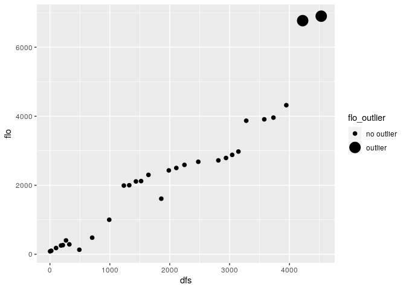
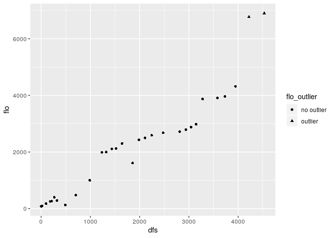
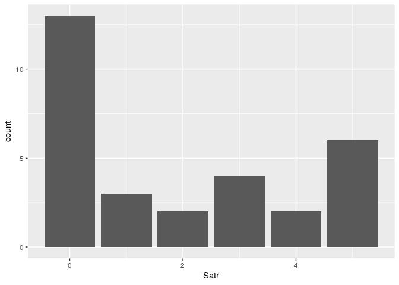
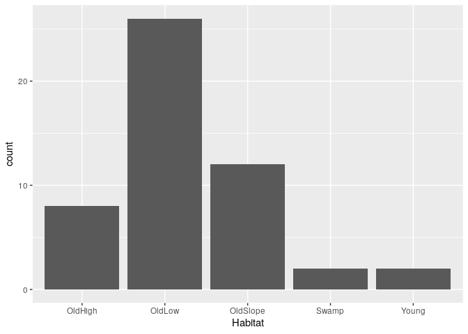
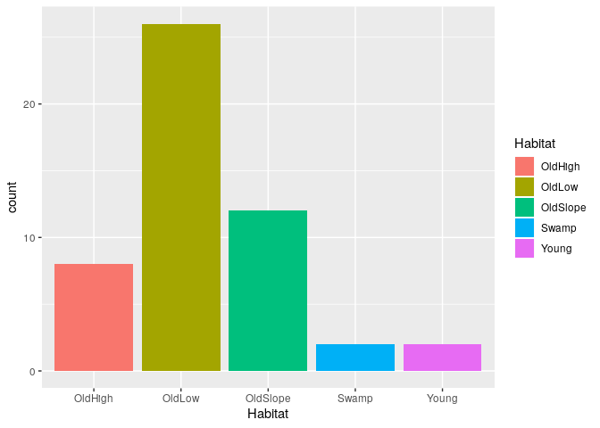
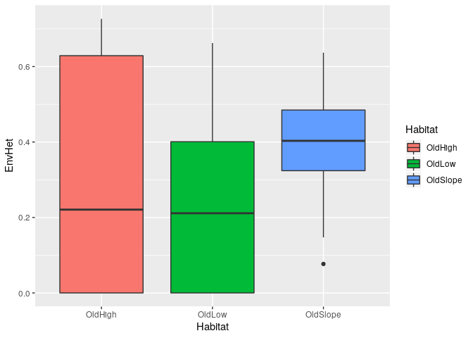

<!-- Este .md fue generado a partir del .Rmd homónimo. Edítese el .Rmd -->
Introducción a R y Visualización rápida de datos
================================================

Introducción a R
----------------

### Recursos

Te paso a continuación algunas fuentes (mayoritariamente en español) sobre las aplicaciones que manejarás y otros recursos.

-   Sobre [R](https://www.r-project.org/)
    -   [Vídeo corto sobre la historia de R](https://es.coursera.org/lecture/intro-data-science-programacion-estadistica-r/historia-e-introduccion-a-r-alNk0), donde podrás aprender algunas las características de R y el software libre en general, ventajas y desventajas de R, así como algunas aplicaciones.
    -   [Libro R4DS, R for Data Science](https://r4ds.had.co.nz/), una fuente muy completa realizada principalmente por Wickham & Grolemund (2017), con apoyo de la comunidad R. [Fue traducido recientemente a español](https://es.r4ds.hadley.nz/) por la comunidad R hispanohablante. Es un buen punto de partida. La organización del libro, que priorice el aparato gráfico sobre la parte programática, ayudan a mantener la motivación en el aprendizaje de R. Seguiré este esquema, pero usando datos ecológicos, tanto para las asignaciones, como para este guión de referencia.
    -   [Esta web](https://oscarperpinan.github.io/R/) es bastante completa, y es a la vez un buen lugar de referencia.
    -   [Este libro](https://cran.r-project.org/doc/contrib/rdebuts_es.pdf) está organizado con enfoque de programación, todo un clásico.
    -   La existencia de una diversa y activa comunidad R, motiva a muchos/as usuarios/as a usar este entorno de programación. [Abajo](#twitter) coloqué algunas cuentas de Twitter donde podrás observar en vivo una mínima parte de la actividad de la comunidad R. Hay muchas otras cuentas, foros, sitios web e incluso reuniones periódicas donde podrás interactuar con la comunidad. Te animo a descubrirlas.
    -   [RStudio](https://www.rstudio.com/). Tanto la página de Wikipedia como [este vídeo](https://www.youtube.com/watch?v=5XeFFoTf2IY) explican muy bien en qué consiste este entorno de desarrollo integrado, además de que hace una breve introducción a qué es R.
-   [Git](https://git-scm.com/). Bueno, esta es una larga historia, que parece estar bien resumida en [Wikipedia](https://es.wikipedia.org/wiki/Git). Busca en YouTube, y verás otros aportes.
-   [GitHub](https://github.com/). Se erige como un servicio público para desarrolladores y desarrolladoras. Luce bien explicado [aquí](https://www.deustoformacion.com/blog/programacion-diseno-web/que-es-para-que-sirve-github).
-   [GitHub Classroom](https://github.com/education/classroom%5D). En [esta web](https://www.genbeta.com/desarrollo/classroom-for-github-ayudando-a-los-profesores-a-gestionar-los-ejercicios-de-sus-clases) te explican para qué sirve. Con este servicio estoy asignándote trabajo. También te recomiendo que leas [ésta afirmación](https://github.com/education/classroom#who-is-classroom-for).
-   Foros de ayuda y listas de distribución, entre los que destacan [R-help](https://stat.ethz.ch/mailman/listinfo/r-help), [R-devel](https://stat.ethz.ch/mailman/listinfo/r-devel), [Stackoverflow](https://stackoverflow.com/). Las preguntas deben plantearse con un ejemplo reproducible. Si vas a plantear una, lee antes las guías de publicación. Existe una [lista de distribución de R-help en español](https://stat.ethz.ch/mailman/listinfo/r-help-es), así como de [Stackoverflow en español](https://es.stackoverflow.com/).
-   <a name="twitter"></a>Twitter:
    -   [The R Foundation](https://twitter.com/_r_foundation)
    -   [RStudio](https://twitter.com/rstudio)
    -   [RLadies](https://twitter.com/RLadiesGlobal)
    -   [We Are R-Ladies](https://twitter.com/WeAreRLadies)
    -   [Comunidad R Hispano](https://twitter.com/r_hisp?lang=es)
    -   [Hadley Wickham](https://twitter.com/hadleywickham)
    -   [Gabriela de Queiroz](https://twitter.com/gdequeiroz)
    -   [R Consortium](https://twitter.com/rconsortium)
    -   [UseR! 2020](https://twitter.com/useR2020stl)
    -   [UseR! 2019](https://twitter.com/UseR2019_Conf)
    -   [Rstats](https://twitter.com/rstatstweet)

### Instalación y ejecución de R y RStudio

-   Puedes usar el servidor RStudio habilitado por el profesor. Habrás recibido un correo electrónico con los detalles de acceso.

-   Si prefieres trabajar en tu propia PC, instala R y RStudio. La guía de instalación varía mucho según el sistema operativo:
    -   [R](https://cloud.r-project.org/)
    -   [RStudio](https://www.rstudio.com/products/rstudio/download/#download)
-   Igualmente, la forma de ejecutar estas aplicaciones dependerá del sistema operativo.
    -   En GNU/Linux es posible ejecutar tanto aplicaciones tanto desde el gestor de ventanas como desde el intérprete de línea de órdenes (CLI) o "terminal" (por ejemplo, para ejecutar R, presiona `CRTL+ALT+T`, escribe `R` y presiona `<enter>`).
    -   En Windows y MacOS la ejecución se realiza desde el GUI.

### CRAN (Comprehensive R Archive Network)

-   [¿Qué es CRAN?](https://cran.r-project.org/doc/FAQ/R-FAQ.html#What-is-CRAN_003f)
-   Instalar paquetes: Ejemplo: `install.packages('vegan', dependencies = T)`. Si realizas tus asignaciones en el servidor RStudio habilitado por el profesor, no necesitarás instalar paquetes.

### Ayuda de R

``` r
help(package = 'base') #Ayuda sobre un paquete
library(help = 'base') #Documentación sobre un paquete
help(lm) #Ayuda sobre una función
?lm #Ídem
example(lm) #Ejemplo(s) sobre una función
help.search("matrix") #Busca la palabra clave en las ayudas de los paquetes
??matrix #Ídem
```

¡Usa los foros! Si introduces un mensaje de error de R en el buscador de tu preferencia (en inglés obtienes más resultados), encontrarás varios punteros a foros con posibles soluciones.

Visualización de datos
----------------------

Wickham & Grolemund (2017) afirman que, durante la producción de resultados comunicables, subyace la necesidad de realizar el análisis exploratorio de datos (AED o EDA) lo más rápidamente posible. El esquema a continuación, de la misma fuente, resume este proceso:


Las múltiples herramientas ofrecidas por los paquetes de la colección `tidyverse` te servirán para agilizar sustancialmente el EDA. Los paquetes `dplyr`, `tidyr` y otros, te ayudarán a importar, ordenar y transformar datos, mientras `ggplot2` te ayudará a crear gráficos estilizados eficientemente. Wickham & Grolemund (2017) aseguran que estas herramientas mantienen la motivación en el aprendizaje por sus flujos de trabajo lineales.

### El conjunto de datos `doubs`

Una de las fuentes que utilizo en esta guía de referencia, es el conjunto de datos `doubs` de Verneaux (1973). Se cargan meidante el paquete `ade4`. Estos datos se utilizan también en Borcard, Gillet, & Legendre (2018).

``` r
library(ade4)
data(doubs)
```

> **Nota**. Si no usas el servidor RStudio habilitado por el profesor, instala `ade4` con `install.packages('ade4', dependencies = T)`

La sentencia anterior carga el objeto `doubs` a memoria, pero no lo imprime en pantalla. `doubs` es una lista de 4 tablas o *data.frame*, etiquetadas como `env`-matriz ambiental, `fish`-matriz de comunidad usando abundancia semi-cuantitativa (más explicación abajo), `xy`-matriz de coordenadas de las muestras y `species`-nombres de las 27 especies encontradas. Las filas de los tres primeros *data.frame* corresponden a 30 sitios muestreados a lo largo del río franco-suizo Doubs.

<a name="doubs"></a>Como ves, el objeto `doubs` se compone de varios elementos, por lo que es preferible imprimirlo en pantalla por separado. Para imprimir sólo un objeto de una lista, se usa el operador `$`. Así, `doubs$env`, imprime sólo la matriz ambiental.

``` r
set.seed(98)
doubs$env[sample(1:30, 6), ] #Sólo 6 filas mostradas, elegidas al azar
##     dfs alt   slo  flo pH har pho nit amm oxy bdo
## 15 1645 415 1.792 2300 86  86  40 100   0 117  21
## 10  990 617 4.605 1000 77  82   6  75   1 100  43
## 29 4220 183 1.946 6770 78 110  45 162  10  90  42
## 13 1436 450 3.091 2110 81  98   6  52   0 124  24
## 7   268 841 4.205  400 81  88   7  15   0 111  22
## 8   491 792 3.258  130 81  94  20  41  12  70  81
```

`doubs$env` contiene información ambiental de los 30 sitios de colecta (filas) con las siguientes variables (columnas): `dfs`-distancia desde cabecera (en km x 10), `alt`-altitud (en m), `slo`-pendiente (log(x+1), donde x es la pendiente en tantos por 1000), `flo`-caudal promedio mínimo (m<sup>3</sup>/s 100), `pH` ( x 10), `har`-dureza del agua (mg/l de calcio), `pho`-fostados (mg/l x 100), `nit`-nitratos, `amm`-amoníaco, `nit`-nitrógeno (mg/l x 100), `oxy`-oxígeno disuelto (mg/l x 100), `bdo`-demanda biológica de oxígeno (mg/l x 10)

La tabla `doubs$fish`, asociada a la anterior, contiene la abundancia de especies por sitio. Los valores de las celdas no son individuos; la abundancia está representada en una escala semi-cuantitativa específica por especie, que va de 0 a 5. Por lo tanto, los valores no pueden entenderse como estimadores insesgados de la abundancia real o de la biomasa por sitio (Borcard et al., 2018). La abreviatura usada como nombre de columna se explica en la tabla `doubs$species`.

``` r
set.seed(99)
doubs$fish[sample(1:30, 6), sample(1:27, 6)] #Sólo 6 filas y columnas mostradas, elegidas al azar
##    Rham Phph Scer Ruru Gogo Icme
## 21    3    1    2    5    5    1
## 9     0    1    0    4    0    0
## 11    0    4    0    0    0    0
## 5     0    3    2    5    2    0
## 15    0    4    0    0    2    0
## 13    0    5    0    0    0    0
```

La tabla `doubs$species` contiene los nombre de las 27 especies de peces.

``` r
doubs$species
##                     Scientific             French           English code
## 1                 Cottus gobio             chabot european bullhead Cogo
## 2           Salmo trutta fario       truite fario       brown trout Satr
## 3            Phoxinus phoxinus             vairon            minnow Phph
## 4       Nemacheilus barbatulus      loche franche       stone loach Neba
## 5          Thymallus thymallus              ombre          grayling Thth
## 6     Telestes soufia agassizi            blageon           blageon Teso
## 7           Chondrostoma nasus               hotu              nase Chna
## 8       Chondostroma toxostoma          toxostome         toxostoma Chto
## 9          Leuciscus leuciscus           vandoise       common dace Lele
## 10 Leuciscus cephalus cephalus           chevaine              chub Lece
## 11               Barbus barbus barbeau fluviatile            barbel Baba
## 12       Spirlinus bipunctatus            spirlin           spirlin Spbi
## 13                 Gobio gobio             goujon           gudgeon Gogo
## 14                 Esox lucius            brochet              pike Eslu
## 15           Perca fluviatilis  perche fluviatile             perch Pefl
## 16              Rhodeus amarus           bouviere        bitterling Rham
## 17            Lepomis gibbosus      perche-soleil       pumpkinseed Legi
## 18  Scardinius erythrophtalmus           rotengle              rudd Scer
## 19             Cyprinus carpio              carpe              carp Cyca
## 20                 Tinca tinca             tanche             tench Titi
## 21               Abramis brama              breme  freshwater bream Abbr
## 22             Ictalurus melas       poisson chat    black bullhead Icme
## 23              Acerina cernua           gremille             ruffe Acce
## 24             Rutilus rutilus             gardon             roach Ruru
## 25             Blicca bjoerkna   breme bordeliere      silver bream Blbj
## 26           Alburnus alburnus            ablette             bleak Alal
## 27           Anguilla anguilla           anguille               eel Anan
```

Las cuatro columnas corresponden a: `Scientific`-nombre científico, `French` y `English`-nombres comunes en francés y en inglés, `code` códigos de cuatro caracteres usados como nombres de columnas en la tabla `doubs$fish`.

### El conjunto de datos `BCI`

`BCI` es una matriz de comunidad, muy popular en ecología, porque se utiliza como conjunto de datos modelo en el paquete `vegan`, muy usado en ecología (Oksanen et al., 2013). `BCI` contiene conteos (abundancias reales) de árboles de al menos 10 cm de diámetro a la altura de pecho (DAP o *DBH*) registrados en 50 parcelas (filas de la matriz) de 1 hectárea cada una, para un total de 225 especies (columnas de la matriz). Los nombres científicos se muestran íntegramente, aunque el espacio separador entre género y especie es sustituido por un `.`. A continuación se muestra una selección aleatoria de 6 parcelas y 3 especies de la matriz de comunidad.

``` r
library(vegan)
data(BCI)
set.seed(10)
BCI[sample(1:50, 6), sample(1:225, 3)] #Sólo 6 filas y 3 columnas mostradas, elegidas al azar
##    Lacmellea.panamensis Eugenia.nesiotica Hirtella.americana
## 35                    1                 0                  0
## 5                     2                 0                  0
## 11                    0                 0                  0
## 13                    1                 2                  0
## 47                    2                 1                  0
## 28                    0                 1                  0
```

En el mismo paquete se encuentra también la matriz ambiental `BCI.env`, asociada a la anterior. `BCI.env` es un `data.frame` de 50 parcelas (filas) y nueve variables de sitio (columnas) descritas a continuación. `UTM.EW` y `UTM.NS`-coordenadas UTM de falso Este y falso Norte (zona 17N), `Precipitation`-precipitación en mm por año, `Elevation`-elevación en metros sobre el nivel del mar, `Age.cat`-categoría de edad del bosque, `Geology`-formación geológica subyacente, `Habitat`-tipo hábitat dominante predominante, `Stream`-"*Yes*" si hay un hábitat de ribera fluvial en la parcela, `EnvHet`-heterogeneidad ambiental evaluada por medio de la diversidad de frecuencia de tipos de hábitat de Simpson en 25 celdas de cuadrícula dentro de la parcela. Puedes consultar información detallada sobre cada variable en Harms, Condit, Hubbell, & Foster (2001).

``` r
data(BCI.env)
set.seed(11)
BCI.env[sample(1:50, 6), ] #Sólo 6 filas mostradas, elegidas al azar
##    UTM.EW  UTM.NS Precipitation Elevation Age.cat Geology  Habitat Stream
## 14 625954 1011869          2530       120      c3      Tb   OldLow     No
## 1  625754 1011569          2530       120      c3      Tb OldSlope    Yes
## 25 626154 1011969          2530       120      c3      Tb   OldLow     No
## 49 626654 1011869          2530       120      c3      Tb   OldLow     No
## 3  625754 1011769          2530       120      c3      Tb   OldLow     No
## 43 626554 1011769          2530       120      c3      Tb OldSlope     No
##    EnvHet
## 14 0.1472
## 1  0.6272
## 25 0.6080
## 49 0.4992
## 3  0.0000
## 43 0.0768
```

### El conjunto de datos `mite`

`mite` es un conjunto de tres `data.frame` sobre ácaros oribatidos y sus variables ambientales, colectados en 70 sitios mediante núcleos de suelo en una parcela de 2.5 x 10 m, los cuales fueron publicados en dos trabajos (Borcard & Legendre, 1994; Borcard, Legendre, & Drapeau, 1992). Al igual que los anteriores, este conjunto de datos se carga a través del paquete `vegan`. El primero, `mite` propiamente, contiene la matriz de comunidad con los datos de abundancia de 35 especies (columnas) de ácaros oribátidos para cada uno de los 70 sitios (filas).

``` r
data(mite)
set.seed(40)
mite[sample(1:70, 6), sample(1:35, 6)] #Sólo 6 filas y 6 columnas mostradas, elegidas al azar
##    PPEL Miniglmn Trhypch1 RARD MEGR ONOV
## 15    2        1        0    0    1    7
## 41    0        0        0    0    0    5
## 26    0        0        0    1    1   27
## 10    0        2        0    3    0   33
## 7     0        0        0    2    3   27
## 46    0        0        0    0    2   22
```

`mite.env` contiene datos ambientales de los sitios de colecta, que incluye `SubsDens`-densidad del sustrato (g/L); `WatrCont`-contenido de agua del substrato (g/L); `Substrate`-tipo de substrato, pudiendo tomar los valores `Sphagn1`, `Sphagn2`, `Sphagn3`, `Sphagn`, `Litter`, `Barepeat` e `Interface`; `Shrub`-que indica la densidad de arbustos, pudieno tomar tres posibles niveles `1`, `2` o `3`; finalmente la variable `Topo`-que puede tomar los valores `Blanket` y `Hummock`.

``` r
data(mite.env)
set.seed(30)
mite.env[sample(1:70,6),] #Sólo 6 filas mostradas, elegidas al azar
##    SubsDens WatrCont Substrate Shrub    Topo
## 7     36.95   378.93   Sphagn1   Few Hummock
## 34    53.17   367.11 Interface  Many Blanket
## 25    35.30   293.49 Interface  Many Blanket
## 29    32.86   323.12 Interface  Many Hummock
## 20    38.61   145.68 Interface  Many Hummock
## 10    32.14   220.73   Sphagn1  Many Hummock
```

Finalmente, `mite.xy` contiene las coordenadas (con origen arbitrario) de los 70 sitios.

``` r
data(mite.xy)
set.seed(50)
mite.xy[sample(1:70,6),] #Sólo 6 filas mostras, elegidas al azar
##       x   y
## 50 0.60 6.9
## 31 0.20 4.7
## 14 2.00 2.3
## 52 0.05 7.3
## 34 1.00 5.3
## 3  1.20 0.3
```

### Un **"detallito"** sobre matrices de comunidad y ambientales en R

**La mayoría de los paquetes para análisis en ecología asumen que el orden de las filas de ambas matrices es consistente**. Por ejemplo, `vegan` asume que la fila `n` de las matrices de comunidad y ambiental se refieren al mismo "sitio". Si por accidente, o deliberadamente, el usuario reordenara las filas de una matriz, sin hacerlo igualmente en la otra, cualquier análisis que intente poner en relación datos composicionales con ambientales será fútil e inconsistente.

Se trata de un **pequeño detalle a tener muy presente** al momento de manipular datos ecológicos. Una medida para evitar posibles errores, sería crear columnas de nombres de sitios a partir de los nombres de filas en ambas matrices, justo después de cargarlas. Si se perdiera la integridad entre ambas siempre se podrían hacer uniones a partir de dichas columnas.

### Diagrama de dispersión

Lee sobre el [diagrama de dispersión](https://es.wikipedia.org/wiki/Diagrama_de_dispersi%C3%B3n). Si observas detenidamente las variables `dfs` y `flo` de la [tabla `doubs$env`](#doubs), quizá no detectes a golpe de vista que existe correlación entre ambas; es precisamente en este punto donde los gráficos te pueden ayudar.

``` r
library(tidyverse)
```

> **Nota**. Si no realizas tu asignación en el servidor RStudio habilitado por el profesor, debes asegurarte de instalar la colección `tidyverse` (`install.packages(tidyverse, dependencies=T)`).

El gráfico de dispersión a continuación muestra que existe correlación positiva entre las variables seleccionadas.

``` r
ggplot(data = doubs$env) +
  geom_point(mapping = aes(x = dfs, y = flo))
```


Lógicamente, como es de esperar, a mayor distancia de la cabecera, mayor el caudal. Destacan también dos observaciones atípicas en el extremo superior derecho del gráfico, que corresponden a dos puntos de colecta que obtuvieron valores de flujo muy altos. Volveré sobre estos valores extremos (*outliers*) maś adelante.

`ggplot` crea el sistema de coordenadas a partir del objeto introducido en el argumento `data`, es decir, a partir del conjunto de datos (`ggplot` convierte este objeto a un `data.frame` si al entrar en la función aún no lo es). Por lo tanto, si ejecutaras `ggplot(data = dfs_flo)` obtendrás un gráfico vacío.

A partir de este punto, se pueden añadir una o más capas. En este caso, se añadió una de puntos mediante `geom_point`. Las capas usan el argumento `mapping` para definir la posición y el rol de cada variable en el gráfico. Por lo tanto, los elementos básicos son crear el sistema de coordenadas (`ggplot`), especificar los datos, crear una capa (e.g. `geom_point`) y decclarar cómo se posicionarán las variables. [Aquí](https://www.rstudio.com/wp-content/uploads/2015/03/ggplot2-cheatsheet.pdf) tienes una guía de referencia sobre las capas más comunes.

Puedes editar la forma y el tamaño de todos los elementos del gráfico: rótulos, simbología, cuadrícula, ejes, etc. Existen múltiples argumentos disponibles para gráficos estéticos, que encontrarás en guías de `ggplot2` en línea, como [ésta](https://www.rdocumentation.org/packages/ggplot2/versions/3.2.1) y [esta](https://swcarpentry.github.io/r-novice-gapminder-es/08-plot-ggplot2/index.html). También puedes ver [esta galería](http://www.ggplot2-exts.org/gallery/) para conocer distintas formas de visualizar datos. Puedes también consultar Wickham (2016), un material de contenido exhaustivo y de referencia, donde verás las distintas capas y configuraciones estéticas.

Mostraré los puntos en función de su condición de *outliers*, utilizando distintos colores y formas. No prestes mucha atención a la primera línea de código, sino al gráfico resultante

``` r
flo_outlier <- ifelse(
  doubs$env$flo %in% invisible(boxplot(doubs$env$flo)$out),
  'outlier', 'no outlier')
```

``` r
ggplot(data = doubs$env) +
  geom_point(mapping = aes(x = dfs, y = flo, colour = flo_outlier))
```


``` r
ggplot(data = doubs$env) +
  geom_point(mapping = aes(x = dfs, y = flo, size = flo_outlier))
## Warning: Using size for a discrete variable is not advised.
```



``` r
ggplot(data = doubs$env) +
  geom_point(mapping = aes(x = dfs, y = flo, shape = flo_outlier))
```



Aunque no son muy informativos sin barras de error, los gráficos de barras pueden ser útiles en determinados contextos. Utilizaré la escala semi-cuantitativa de abundancia para responder a la pregunta: ¿cuál es el nivel de abundancia predominante de `Salmo trutta fario` en la muestra?

``` r
ggplot(data = doubs$fish) + geom_bar(mapping = aes(x=Satr))
```



Este gráfico "informa" que el nivel de abundancia más común es 0, es decir, la subespecie está ausente en 13 de los 30 sitios, con lo que es más común no encontrarla. Si ordenásemos las pseudo-abundancias de `Satr` de menor a mayor, podríamos igualmente notar este patrón, lo cual sugiere que el gráfico no aporta mucho más que lo que lo haría un vector ordenado.

``` r
sort(doubs$fish[,2])
##  [1] 0 0 0 0 0 0 0 0 0 0 0 0 0 1 1 1 2 2 3 3 3 3 4 4 5 5 5 5 5 5
```

Fíjate en este otro gráfico de barras usando el conjunto de datos `BCI`. El argumento `fill` en el segundo gráfico rellena las barras de manera que se pueden diferencias los distintos hábitat con mayor facilidad. Es posible configurar los colores en cada caso con la funcipon `scale_fill_discrete`

``` r
ggplot(data = BCI.env) +  geom_bar(mapping = aes(x = Habitat))
```



``` r

ggplot(data = BCI.env) +
  geom_bar(mapping = aes(x = Habitat, fill = Habitat))
```



Nota que hay dos hábitats escasamente representados, que son *Swamp* y *Young*. El EDA está informando que, en determinados análisis, estos grupos no aportarían efectos sistemáticos o, en su defecto, harían que determinados supuestos no se cumplieran. No entraré en detalles sobre cómo filtro los datos para excluir ambos grupos (más adelante verás cómo usar `tidyverse` para filtrar datos y otras tareas), así que ignora la parte "fea" del código y fíjate en el gráfico.

``` r
grupos_numerosos <- droplevels(
  BCI.env[!BCI.env$Habitat %in% c('Swamp', 'Young'), ]
)
ggplot(data = grupos_numerosos) +
  geom_bar(mapping = aes(x = Habitat, fill = Habitat))
```


Para variables cuantitativas, el diagrama de cajas, mejor conocido como *boxplot*, es sin duda un apoyo fundamental. Te recomiendo la [entrada de Wikipedia](https://es.wikipedia.org/wiki/Diagrama_de_caja) sobre este útil gráfico. A golpe de vista, verás a continuación la variable "heterogeneidad ambiental" según hábitats, utilizando el objeto `grupos_numerosos` creado en el trozo de código anterior (excluye los hábitats poco representados).

``` r
ggplot(data = grupos_numerosos) +
  geom_boxplot(mapping = aes(x = Habitat, y = EnvHet, fill = Habitat))
```



¿Qué patrón percibes? Compara la heterogeneidad ambiental en los bosques viejos sobre vertiente (`OldSlope`) con la de los demás hábitats. ¿Qué diferencias notas?

Finalmente, veamos algunos gráficos con el conjunto de datos `mite`.

### Facetas o paneles

Es posible probar con otros pares de variables, par a par, pero `ggplot2` trae funciones incorporadas para asistirte en dicha tarea, construyendo facetas o paneles de gráficos.

### Panel de correlaciones

El paquete `ez`, apoyándose en `ggplot2`, construye gráficos de dispersión, gráficos de densidad e imprime a su vez el valor del coeficiente `r`. Muy útil cuando se quiere explorar muchas variables al mismo tiempo. Fíjate en este útil panel de correlaciones usando el conjunto `doubs`.

``` r
library(ez)
ezCor(
  doubs$env,
  r_size_lims = c(4,8),
  label_size = 7
)
```


> **Nota**. la función `ezCor` sólo admite `data.frame` compuestos por columnas numéricas.

Aunque los paquetes de análisis de datos ecológicos no están "saborizados" al estilo `tidyverse`, al menos el EDA lo podrás realizar utilizando tuberías de esta potente colección de paquetes.

``` r
dfs_flo <- doubs$env %>% select(dfs, flo)
dfs_flo
##     dfs  flo
## 1     3   84
## 2    22  100
## 3   102  180
## 4   185  253
## 5   215  264
## 6   324  286
## 7   268  400
## 8   491  130
## 9   705  480
## 10  990 1000
## 11 1234 1990
## 12 1324 2000
## 13 1436 2110
## 14 1522 2120
## 15 1645 2300
## 16 1859 1610
## 17 1985 2430
## 18 2110 2500
## 19 2246 2590
## 20 2477 2680
## 21 2812 2720
## 22 2940 2790
## 23 3043 2880
## 24 3147 2976
## 25 3278 3870
## 26 3579 3910
## 27 3732 3960
## 28 3947 4320
## 29 4220 6770
## 30 4530 6900
```

El operador `%>%`, bautizado como "pipa" (*pipe*), pertenece al paquete `magrittr`, el cual es importado automáticamente cuando se instala la colección `tidyverse`. Este operador utiliza la salida de la función a su izquierda y la coloca como primer argumento de la función a la derecha. Así, la sentencia anterior se lee como "del objeto `doubs$env`, selecciona las columnas `dfs` y `flo` y con el resultado crea el objeto `dfs_flo`".

<!-- ## Directorio de trabajo -->
<!-- * Para consultar tu directorio de trabajo en R: `getwd()`. -->
<!-- * Si usas el servidor RStudio habilitado por el profesor, la ruta por defecto será algo parecido a ésto: `'/home/<tunombredeusuario>'`. Esta ruta se denomina "carpeta personal". -->
<!-- * Puedes cambiar tu directorio de trabajo mediante `setwd('<rutademipreferencia>')`. -->
<!-- ## Objetos -->
<!-- ### Crear objetos -->
<!-- El operador de asignación ` <- ` te da la bienvenida, aunque también se puede escribir ` -> `. Transfórmalo en una flecha: hacia donde apunta es el valor que asume el nombre de objeto que se encuentra en el lado contrario. Lee `a <- 'Hola R'` como al objeto `a` es un vector cuyo valor es la cadena de caracteres `'Hola R'`. Creado el objeto, pedimos por ejemplo que se nos muestre su valor. En la consola se vería así: -->
<!-- ```{r} -->
<!-- a <- 'Hola R' -->
<!-- a -->
<!-- ``` -->
<!-- Al escribir `a` estamos llamando el objeto, y pedimos que se imprima su valor. Es equivalente a: -->
<!-- ```{r} -->
<!-- print(a) -->
<!-- ``` -->
<!-- Encontrarás largas discusiones y acalorados debates sobre si usar ` <- ` como asignador o `=`. Por limpieza de código, y para evitar confusión entre argumentos de funciones y declaraciones de objetos, recomiendo usar ` <- ` como asignador. -->
<!-- ### Tipos -->
<!-- ### Guardar -->
<!-- ## Scripts -->
<!-- * Crear. -->
<!-- * Guardar. -->
<!-- ## Tablas (`data.frame`, `tibble`) -->
<!-- * Crear. -->
<!-- * Importar. -->
<!-- * Operaciones básicas. -->
Situaciones comunes
-------------------

-   R es sensible a las mayúsculas. No es lo mismo `Mi_objeto` que `mi_objeto`.
-   *"En RStudio, ¿Qué atajo de teclado es que usan para poner el operador de asignación `<-`?"* Debería funcionarte `ALT+-`, pero recuerda, sólo lo podrás usar en RStudio.
-   *"¿Y el *pipe\* `%>%`?"\* `CTRL+SHIFT+M`.
-   Más atajos de teclado de RStudio: `ALT+SHIFT+K`.
-   *"Me quedé trancá' en la consola de R con un signo de `+`. ¿Qué hago pa' salir de eso?"* Suele resolverse presionando la tecla `Escape` (`Esc`). Lee [este texto](https://support.rstudio.com/hc/en-us/community/posts/200792676-stuck-on-).

Referencias
-----------

Borcard, D., & Legendre, P. (1994). Environmental control and spatial structure in ecological communities: An example using oribatid mites (acari, oribatei). *Environmental and Ecological Statistics*, *1*(1), 37–61.

Borcard, D., Gillet, F., & Legendre, P. (2018). *Numerical ecology with r*. Springer.

Borcard, D., Legendre, P., & Drapeau, P. (1992). Partialling out the spatial component of ecological variation. *Ecology*, *73*(3), 1045–1055.

Harms, K. E., Condit, R., Hubbell, S. P., & Foster, R. B. (2001). Habitat associations of trees and shrubs in a 50-ha neotropical forest plot. *Journal of Ecology*, *89*(6), 947–959.

Oksanen, J., Blanchet, F. G., Kindt, R., Legendre, P., Minchin, P. R., O’hara, R., … others. (2013). Package “vegan”. *Community Ecology Package, Version*, *2*(9), 1–295.

Verneaux, J. (1973). *Cours d’eau de franche-comté (massif du jura): Recherches écologiques sur le réseau hydrographique du doubs: Essai de biotypologie* (PhD thesis). Institut des Sciences Naturelles.

Wickham, H. (2016). *Ggplot2: Elegant graphics for data analysis*. Springer.

Wickham, H., & Grolemund, G. (2017). *R for data science: Import, tidy, transform, visualize, and model data* (1st ed.). Retrieved from <http://r4ds.had.co.nz/>
